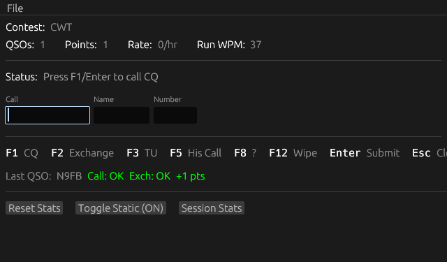
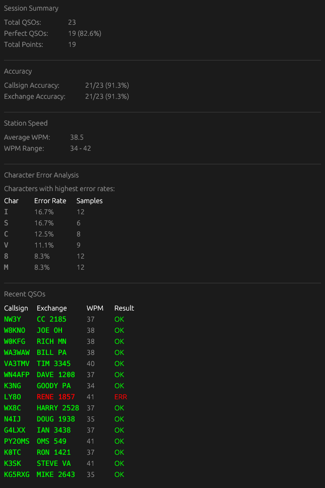

# CW Contest Trainer

A practice tool for amateur radio CW (Morse code) contest operators. Simulate realistic contest conditions and improve your copying and logging skills.




## Quickstart

1. **Download the binary** for your platform from the [Releases page](https://github.com/chadsbrown/contest_trainer/releases):
   - Windows: `contest_trainer-windows-x86_64.exe`
   - macOS Intel: `contest_trainer-macos-x86_64`
   - macOS Apple Silicon: `contest_trainer-macos-aarch64`
   - Linux: `contest_trainer-linux-x86_64`

2. **Download the callsign files** from this repository (right click, save as) and place them in the same directory as the binary:
   - [`callsigns.txt`](https://raw.githubusercontent.com/chadsbrown/contest_trainer/master/callsigns.txt) - for non-CWT contests (this is just a copy of SCP)
   - [`cwt_callsigns.txt`](https://raw.githubusercontent.com/chadsbrown/contest_trainer/master/cwt_callsigns.txt) - for CWT contest (this is just a copy of the history file for CWT from N1MM+)
   - [`arrldx_callsigns.txt`](https://raw.githubusercontent.com/chadsbrown/contest_trainer/master/arrldx_callsigns.txt) - for ARRL DX CW (copy of history file for ARRL DX CW from N1MM+)

3. **Run the application** 
4. **Personalize settings** (File->Settings) to configure your callsign, name and exchange info.
5. **Start running** by pressing F1/Enter to send your first CQ.

## Features

- **Multi-platform Support**: Run on Windows, macOS, and Linux
- **Multiple Contest Types**: Practice for CWT (default), CQ World Wide, ARRL Sweepstakes, and ARRL DX CW
- **Realistic Audio Simulation**: Hear CW signals with configurable speed, pitch, and signal strength variations
- **Multiple Simultaneous Callers**: Handle pileups with multiple stations calling at once
- **Background Noise**: Adjustable noise level to simulate real band conditions
- **Tail-Ender Support**: Stations may call immediately after a QSO without waiting for your next CQ
- **Partial Call Queries**: Use F5 to query a partial callsign when you can't copy the full call
- **AGN Requests**: Use F8 to ask a station to repeat their exchange, or use F8 to have callers repeat callsigns
- **Score Tracking**: Track QSOs, points, and hourly rate
- **Session Statistics**: Detailed performance analysis including accuracy rates, WPM statistics, and character-level error tracking
- **Persistent Settings**: Your configuration is saved between sessions

## Downloads

Pre-built binaries for Windows, macOS (Intel and Apple Silicon), and Linux are available on the [Releases page](https://github.com/chadsbrown/contest_trainer/releases).

## Keyboard Controls

| Key | Function |
|-----|----------|
| F1 | Send CQ |
| F2 | Send Exchange |
| F3 | Send TU (thank you) |
| F5 | Query partial callsign (His Call) |
| F8 | Request repeat (?) |
| F12 | Wipe (clear callsign and exchange fields) |
| Enter | Submit current field / Send CQ if empty |
| Tab | Switch between callsign and exchange fields |
| Space | Move between exchange fields |
| Up Arrow | Increase your WPM |
| Down Arrow | Decrease your WPM |
| Esc | Clear inputs and stop audio |

## UI Controls

The main window includes several buttons at the bottom:

- **Reset Stats**: Clear all QSO statistics and start fresh
- **Toggle Static**: Enable/disable background noise
- **Session Stats**: Open a detailed statistics window showing accuracy, WPM analysis, character error rates, and recent QSOs

## Settings

Access settings via File > Settings. The settings window opens as a separate window.

### User Settings

- **Your Callsign**: Your amateur radio callsign
- **Your Name**: Your name (used in some contest exchanges)
- **CQ Zone**: Your CQ zone number
- **Section**: Your ARRL section
- **Your WPM**: Speed for your transmitted CW
- **Font Size**: UI font size
- **AGN Message**: Message sent when requesting a repeat (default: "?")

### Contest Settings

- **Contest Type**: Select from CWT, CQ World Wide, ARRL Sweepstakes, or ARRL DX CW
- **CQ Message**: Your CQ message (default: "CQ TEST")
- **Callsign File**: Per-contest callsign file used by the selected contest (if applicable)

### Simulation Settings

- **Max Simultaneous Stations**: How many stations can call at once (1-5)
- **Station Probability**: Likelihood of stations calling after your CQ
- **WPM Range**: Speed range for calling stations
- **Frequency Spread**: Pitch variation between stations (Hz)
- **Signal Strength Range**: Volume variation between stations
- **Mute background noise during TX**: Realism (probably for most people this is more realistic.  yes, there are exceptions.)
- **Caller Needs Repeat Probability**: Chance that a caller will send "AGN" or "?" requesting you repeat your exchange
- **Filter Callers by Country**: Enable/disable country-based caller filtering. When enabled, controls the mix of domestic vs DX callers
- **Same Country Probability**: (Only shown when filter is enabled) Controls how often callers are from your same DXCC country (0.0-1.0). Lower values mean more DX callers, higher values mean more domestic callers. Default is 0.1 (10% domestic). Uses cty.dat for country lookups based on callsign prefixes.

### Audio Settings

- **Tone Frequency**: Base pitch for CW tones (Hz)
- **Noise Level**: Background noise intensity
- **Master Volume**: Overall audio volume
- **Static/QRN Settings**: Control static crashes, pops/clicks, and atmospheric noise
- **Enable QSB**: Simulate realistic signal fading on caller signals
  - **Fade Depth**: How much the signal fades (0 = none, 1 = full fade to silence)
  - **Fade Rate**: Fading cycles per minute (higher = faster fading)

## Callsign Files

### Standard Format (callsigns.txt)

One callsign per line. Lines starting with `#` are comments.

```
# Example callsigns
W1AW
K5ZD
N1MM
```

### CWT Format (cwt_callsigns.txt)

CSV format with callsign, name, and member number (or state/country).

```
# callsign, name, member_number
W1AW, JOE, 1
K5ZD, RANDY, 2
W9RE, MIKE, IN
```

### ARRL DX Format (arrldx_callsigns.txt)

CSV format with Call, Name, State, Power, UserText. Provide either State or Power (not both).

```
# Call,Name,State,Power,UserText
2E0CVN,,,50,
K3LR,,PA,,
3Z0X,,,K,
```

## Building from Source

Requires Rust toolchain.

```bash
# Clone the repository
git clone https://github.com/chadsbrown/contest_trainer.git
cd contest_trainer

# Build release binary
cargo build --release

# Run
./target/release/contest_trainer
```

### Linux Dependencies

On Linux, you may need to install audio and GUI dependencies:

```bash
# Debian/Ubuntu
sudo apt-get install libasound2-dev libxcb-render0-dev libxcb-shape0-dev libxcb-xfixes0-dev libxkbcommon-dev
```

## Configuration Location

Settings are stored in:
- Linux: `~/.config/contest_trainer/settings.toml`
- macOS: `~/Library/Application Support/contest_trainer/settings.toml`
- Windows: `%APPDATA%\contest_trainer\settings.toml`

## Acknowledgements

This application was created collaboratively with [Claude](https://www.anthropic.com/claude) and [OpenAI Codex](https://openai.com/codex).

Special thanks to the following people, who contributed feedback/ideas to the development of this application:
- KD9UYC
- DJ5CW
- N9TTK

## About

I created this for myself (N9UNX), but perhaps you might enjoy using it also.  There are several wonderful contest trainers (MorseRunner, G4FON, etc.) out there, and I've used them all.  They have their quirks, but they really helped me improve, and I can't thank the authors of those programs enough for their contributions.  That said, I always wanted something that was cross-platform (or was meant for Linux), so I decided to create this application.  It's still a work in progress, but complete enough that I am already using it as my main practice tool.  (Note:  it is overstatement to say that I created it, by a lot.  Claude (Opus) and Codex (gpt-5.2) created 99% of it -- I merely provided requirements and prompts to get what I wanted, only fixing a few things here and there by hand.)

## Roadmap

- Perhaps add more contests, if people want them (I imagine the will).  Honestly, I could live with just the CWT as the exchange is great practice (w/o a history file, as it is here, and in my opinion how it should be for a practice tool like this).
- Perhaps think about what 2BSIQ would be like, and how it should operate. (presently testing, but more work needed)
- Feedback welcome.

## License

MIT License
