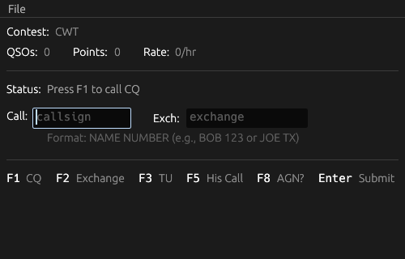

# CW Contest Trainer

A practice tool for amateur radio CW (Morse code) contest operators. Simulate realistic contest conditions and improve your copying and logging skills.



## Features

- **Multiple Contest Types**: Practice for CQ World Wide, NA Sprint, ARRL Sweepstakes, and CWT contests
- **Realistic Audio Simulation**: Hear CW signals with configurable speed, pitch, and signal strength variations
- **Multiple Simultaneous Callers**: Handle pileups with multiple stations calling at once
- **Background Noise**: Adjustable noise level to simulate real band conditions
- **Tail-Ender Support**: Stations may call immediately after a QSO without waiting for your next CQ
- **Partial Call Queries**: Use F5 to query a partial callsign when you can't copy the full call
- **AGN Requests**: Use F8 to ask a station to repeat their exchange
- **Similarity Matching**: Forgiving callsign entry that handles minor copying errors
- **Score Tracking**: Track QSOs, points, and hourly rate
- **Persistent Settings**: Your configuration is saved between sessions

## Downloads

Pre-built binaries for Windows, macOS (Intel and Apple Silicon), and Linux are available on the [Releases page](https://github.com/chadsbrown/contest_trainer/releases).

## Keyboard Controls

| Key | Function |
|-----|----------|
| F1 | Send CQ |
| F2 | Send Exchange |
| F3 | Send TU (thank you) |
| F5 | Query partial callsign (His Call) |
| F8 | Request repeat (AGN?) |
| Enter | Submit current field / Send CQ if empty |
| Tab | Switch between callsign and exchange fields |
| Esc | Clear inputs and stop audio |

## Settings

Access settings via File > Settings. The settings window opens as a separate window.

### User Settings

- **Your Callsign**: Your amateur radio callsign
- **Your Name**: Your name (used in some contest exchanges)
- **CQ Zone**: Your CQ zone number
- **Section**: Your ARRL section
- **Your WPM**: Speed for your transmitted CW
- **Font Size**: UI font size
- **AGN Message**: Message sent when requesting a repeat (default: "?")

### Contest Settings

- **Contest Type**: Select from CQ World Wide, NA Sprint, ARRL Sweepstakes, or CWT
- **Callsign File**: File containing callsigns for non-CWT contests
- **CWT Callsign File**: File containing CWT stations with name/member data

### Simulation Settings

- **Max Simultaneous Stations**: How many stations can call at once (1-5)
- **Station Probability**: Likelihood of stations calling after your CQ
- **WPM Range**: Speed range for calling stations
- **Frequency Spread**: Pitch variation between stations (Hz)
- **Signal Strength Range**: Volume variation between stations

### Audio Settings

- **Tone Frequency**: Base pitch for CW tones (Hz)
- **Noise Level**: Background noise intensity
- **Master Volume**: Overall audio volume

## Callsign Files

### Standard Format (callsigns.txt)

One callsign per line. Lines starting with `#` are comments.

```
# Example callsigns
W1AW
K5ZD
N1MM
```

### CWT Format (cwt_callsigns.txt)

CSV format with callsign, name, and member number (or state/country).

```
# callsign, name, member_number
W1AW, JOE, 1
K5ZD, RANDY, 2
W9RE, MIKE, IN
```

## Building from Source

Requires Rust toolchain.

```bash
# Clone the repository
git clone https://github.com/chadsbrown/contest_trainer.git
cd contest_trainer

# Build release binary
cargo build --release

# Run
./target/release/contest_trainer
```

### Linux Dependencies

On Linux, you may need to install audio and GUI dependencies:

```bash
# Debian/Ubuntu
sudo apt-get install libasound2-dev libxcb-render0-dev libxcb-shape0-dev libxcb-xfixes0-dev libxkbcommon-dev
```

## Configuration Location

Settings are stored in:
- Linux: `~/.config/contest_trainer/settings.toml`
- macOS: `~/Library/Application Support/contest_trainer/settings.toml`
- Windows: `%APPDATA%\contest_trainer\settings.toml`

## License

MIT License
